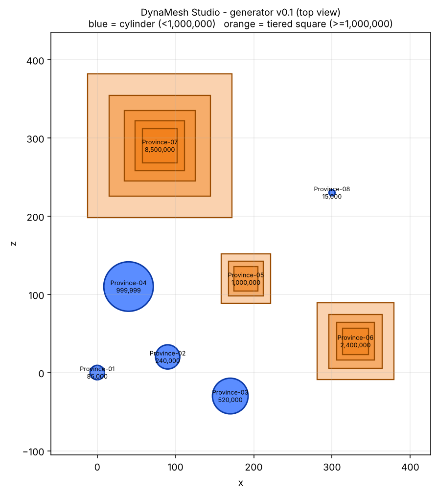

# DynaMesh Studio

Procedural geometry and dynamic node scaling for large-scale virtual environments.

Website: https://dynameshstudio.com
Founded 2026 by Diego, Santiago, Chile.

## What this is

DynaMesh Studio is developing a procedural generation pipeline in **Python** and **Luau** that automates the creation of large-scale 3D province meshes for virtual environments.

### Dynamic node scaling

A scaling system calculates spatial representation from population parameters:

- Nodes under 1,000,000 population render as optimized cylinders.
- Larger "mega-nodes" transform into more complex square geometries.
- The aim is to balance render cost and visual fidelity.

## Try it (generator v0.1)

Requires Python 3.9+. The generator uses only the standard library; the preview image needs `matplotlib`.

```bash
python3 generate.py nodes.json -o out/     # writes out/map.obj and out/manifest.json
python3 -m unittest -v                     # runs the test suite
pip install matplotlib
python3 preview.py out/manifest.json -o preview.png
```

Input is a JSON list of nodes, each with `id`, `name`, `population`, `x`, `z`. Every mesh is validated before anything is written: indices in range, no degenerate triangles, closed and consistently oriented, outward-facing.



## How Claude is used

The founder defines the design, reviews all output, and tests results. Claude is used to:

- Write and refactor the Python geometry generation code.
- Write the Luau integration for the target environment.
- Generate tests and validators for mesh output.
- Review edge cases in the scaling rules and draft documentation.

## Roadmap

This is the plan. Items are checked off only when they work.

### Now: foundations
- [x] Project website and public repository
- [x] Define the input format (region and population parameters per node)
- [x] First Python generator that builds a simple province mesh and exports it
- [x] Implement the node scaling rule (cylinders under 1,000,000, squares above)
- [x] Automated mesh checks and a first demo image

### Next: integration
- [ ] Luau integration to bring generated meshes into the target environment
- [ ] Performance budgeting (part counts, level of detail, render cost)
- [ ] Batch generation across many provinces from one data file
- [ ] Better automatic validation of geometry

### Later: scale
- [ ] Configurations for many regions worldwide
- [ ] Real-time updates when population parameters change
- [ ] Simple tooling or interface to configure and preview a map
- [ ] Public demo and full documentation

## Tech stack

- Python (generation pipeline)
- Luau (integration with the target environment)
- LLM-assisted development

## Repository layout

| Path | Contents |
| --- | --- |
| `generate.py` | Node generator: cylinders under 1,000,000, tiered squares above |
| `validate.py` | Mesh validation checks |
| `test_generate.py` | Test suite |
| `preview.py` | Top-down preview renderer |
| `nodes.json` | Sample input (8 provinces) |
| `preview.png` | Output of the sample run |
| `index.html` | Project website source |
| `CNAME` | Custom domain configuration |

## Contact

Diego, founder@dynameshstudio.com
